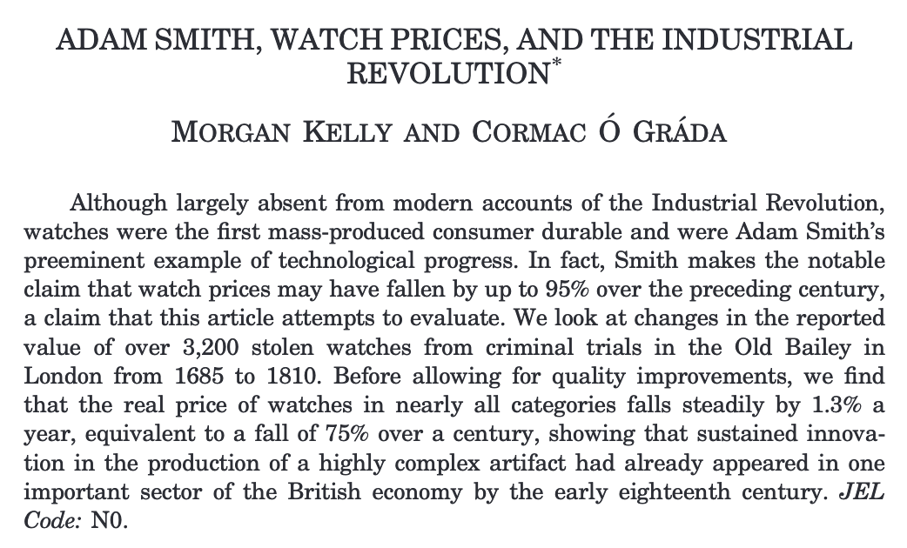
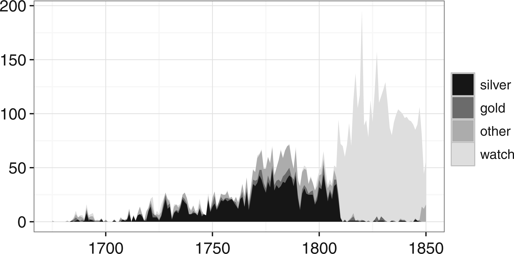
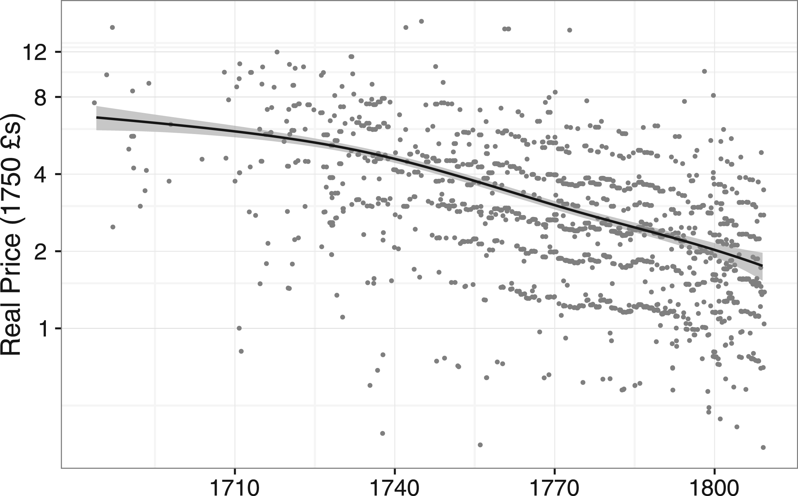
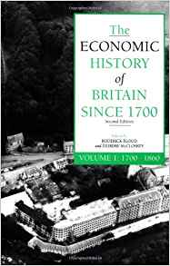
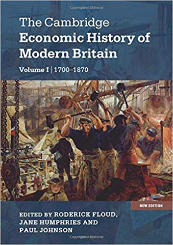

```{r setup, include=FALSE}
knitr::opts_chunk$set(echo = FALSE, warning = FALSE,
                      message = FALSE, fig.align='center', fig.retina=3,
                      out.width="100%", fig.width=6, fig.height=4.5)

library(RefManageR)
BibOptions(check.entries = FALSE, 
           bib.style = "authoryear", 
           style = "markdown",
           dashed = TRUE, hyperlink = FALSE)
source("helper_functions/helper_print_bib.R")
bib <- ReadBib("pres.bib")
```

```{r xaringan-themer, include = FALSE}
library(xaringanthemer)
solarized_light()
source("helper_functions/theme_lecture.R")
xaringanExtra::use_webcam()
xaringanExtra::use_tile_view()
```

class: center, inverse, middle

# Outline

---

.Large[
## Today's goals

+ An overview of British economic history
+ Key themes:
    - Critical perspectives on national accounts
    - The constraints of an organic economy
    - a brief look at productivity
+ This course
    - What we will cover
    - How you will be assessed
]

---

name: return

## Preliminaries 

I want you to...

+ Do the reading
+ Talk! 
    - Active learning is much more effective
+ Engage with numerical evidence
    - [We all start somewhere](#message)

You get out of this...

+ Highly transferable analytic skills!

---

class: inverse, center, middle

# An overview of British economic history

---

```{r gdp_pc}
library(tidyverse)
library(readxl)

real_gdp_eng <- read_xlsx(path = "data/a-millennium-of-macroeconomic-data-for-the-uk.xlsx", 
                      sheet = "A21. GDP per capita 1086+", 
                      range = "A5:K859")

names(real_gdp_eng)[1] <- "Year"

real_gdp_eng %>% 
  filter(Year > 1270) %>% 
  ggplot(aes(Year, `Real GDP per capita`)) +
  #geom_point() + 
  geom_line() +
  scale_x_continuous(breaks = seq(1300, 1900, 50)) +
  ggtitle("English Real GDP per capita, 1270-1939", 
          subtitle = "Source: Broadberry et. al. (2015) & Bank of England") +
  ylab("Real GDP per capita") + 
  theme_lecture 

```

---

```{r gdp_pc_ir}

real_gdp_eng %>% 
  filter(Year > 1270) %>% 
  ggplot(aes(Year, `Real GDP per capita`)) +
  #geom_point() + 
  geom_line() +
  scale_x_continuous(breaks = seq(1300, 1900, 50)) +
  ggtitle("English Real GDP per capita, 1270-1939", 
          subtitle = "Source: Broadberry et. al. (2015) & Bank of England") +
  ylab("Real GDP per capita") + 
  annotate("rect", xmin=1760, xmax=1820, 
           ymin=500, ymax=6000, fill="coral",
           alpha=.3) +
  annotate("text", x=1670, y=5500, 
           label="Industrial revolution?", color="coral") +
  theme_lecture 

```

---

```{r, gdp_pc_ag_transition}
real_gdp_eng %>% 
  filter(Year > 1270) %>% 
  ggplot(aes(Year, `Real GDP per capita`)) +
  #geom_point() + 
  geom_line() +
  scale_x_continuous(breaks = seq(1300, 1900, 50)) +
  ggtitle("English Real GDP per capita, 1270-1939", 
          subtitle = "Source: Broadberry et. al. (2015) & Bank of England") +
  ylab("Real GDP per capita") + 
  annotate("rect", xmin=1760, xmax=1820, 
           ymin=500, ymax=6000, fill="coral",
           alpha=.3) +
  annotate("text", x=1670, y=5500, 
           label="Industrial revolution?", color="coral") +
  annotate("rect", xmin = 1600, xmax=1850, ymin=500, ymax = 4000, 
           fill = 'steelblue', alpha = .3) +
  annotate("text", x=1500, y=4000, 
           label = "Agricultural revolution?", color="steelblue") +
  theme_lecture 
```

---

```{r, gdp_pc_institutions}
real_gdp_eng %>% 
  filter(Year > 1270) %>% 
  ggplot(aes(Year, `Real GDP per capita`)) +
  #geom_point() + 
  geom_line() +
  scale_x_continuous(breaks = seq(1300, 1900, 50)) +
  ggtitle("English Real GDP per capita, 1270-1939", 
          subtitle = "Source: Broadberry et. al. (2015) & Bank of England") +
  ylab("Real GDP per capita") + 
  annotate("rect", xmin=1760, xmax=1820, 
           ymin=500, ymax=6000, fill="coral",
           alpha=.3) +
  annotate("text", x=1670, y=5500, 
           label="Industrial revolution?", color="coral") +
  annotate("rect", xmin = 1600, xmax=1850, ymin=500, ymax = 4000, 
           fill = 'steelblue', alpha = .3) +
  annotate("text", x=1500, y=4000, 
           label = "Agricultural revolution?", color="steelblue") +
  annotate("segment", x=1400, xend = 1688, y=2900, 
           yend = real_gdp_eng$`Real GDP per capita`[real_gdp_eng$Year==1688]) +
  annotate("text", x=1400, y=3200, 
           label = "Institutional/Fiscal/Financial revolution?") +
  theme_lecture 
```

---

### Tantamount to asking what caused the industrial revolution

+ An enormous number of theories -- we will survey many but not all!
    - institutional innovation -> functional credit/property markets `r AutoCite(bib["northConstitutionsCommitmentEvolution1989"])`
    - external trading markets `r AutoCite(bib["findlayPowerPlentyTrade2009","inikoriAfricansIndustrialRevolution2002"])`
        + Slavery & IR sub-debate: for recent reviews see `r AutoCite(bib["oakesCapitalismSlaveryCivil2016", "wrightSlaveryAngloAmericanCapitalism2019"])`
    - Colonies `r AutoCite(bib["pomeranzGreatDivergenceChina2009"])`
    - Easy availability of coal/energy supplies `r AutoCite(bib["pomeranzGreatDivergenceChina2009", "wrigleyEnergyEnglishIndustrial2010"])`
    - (Relatively) highly educated workforce `r AutoCite(bib["kellyPrecociousAlbionNew2014","mokyrEnlightenedEconomyEconomic2012"])`
    - Science/technology `r AutoCite(bib["mokyrEnlightenedEconomyEconomic2012"])`
    - (Relatively) highly paid workforce `r AutoCite(bib["allenBritishIndustrialRevolution2009"])`
    - Others

---

```{r, comparative_perspective}
library(ggrepel)

maddison <- read_xlsx(path = "data/mpd2018.xlsx", 
                      sheet = "Full data")

plotdf <- maddison %>% filter(year <= 1851, 
                    year > 1700, 
                    countrycode %in% c("GBR", "FRA", 
                                       "NLD", "AUT", 
                                       "DEU", "CHN",
                                       "IND", "JPN"),
                    !is.na(cgdppc))

plotdf %>% 
  ggplot(aes(year, cgdppc, 
             group = countrycode,
             color=countrycode)) +
  ggtitle("British GDP per capita in a global mirror", 
          subtitle = "Source: Maddison project") +
  geom_line() +
  geom_point() +
  geom_label_repel(data = plotdf %>%
              group_by(countrycode) %>% 
              filter(year == last(year)) %>% 
              ungroup(), 
            aes(label = country, x = year, y=cgdppc, color=countrycode),
            nudge_x = 15) +
  xlim(c(1700,1900)) +
  guides(color = FALSE) +
  scale_color_brewer(type = "qual", palette = 2) +
  theme_lecture

```

---

```{r, climacteric}

plotdf <- maddison %>% filter(year >= 1800, 
                    year <= 1940, 
                    countrycode %in% c("GBR", "FRA",
                                       "DEU", "USA"),
                    !is.na(cgdppc))

plotdf %>% 
  ggplot(aes(year, cgdppc, 
             group = countrycode,
             color=countrycode)) +
  ggtitle("British GDP per capita in a global mirror", 
          subtitle = "Source: Maddison project") +
  geom_line() +
  geom_point() +
  geom_label_repel(data = plotdf %>%
              group_by(countrycode) %>% 
              filter(year == last(year)) %>% 
              ungroup(), 
            aes(label = country, x = year, y=cgdppc, color=countrycode)) +
  guides(color = FALSE) +
  scale_color_brewer(type = "qual", palette = 2) +
  theme_lecture

```

---

# Key Themes

## Historical national accounts

+ Historical national income accounting -- attempts to measure GDP `r AutoCite(bib["broadberryBritishEconomicGrowth2015"])`
    * Is GDP a good measure of anything? 
    * Alternatives (HDI)?
    * What is the 'average' person?

---

## Reconstructing British national accounts

```{r, broadberry_et_al, fig.align='center', out.width="50%"}
knitr::include_graphics("figures/broadberry_et_al.jpg")
```

---

## How the sausage gets made -- GDP

Three ways to measure GDP

1. Income:

$GDP =(\texttt{daily wage-rates} \times \texttt{days worked}) + \\ (\texttt{return on capital} \times \texttt{capital stock}) + \\ (\texttt{rent} \times \texttt{land area})$
 
2. Expenditure:

$GDP = \texttt{consumption} + \texttt{investment} + \texttt{government spending} + \\ \texttt{net exports}$

3. Output:

$GDP = \texttt{agricultural value added} + \texttt{industrial value added} + \\  \texttt{services value added}$

`r Citet(bib["broadberryBritishEconomicGrowth2015"])` attempt the *output* approach.

---

## How the sausage gets made -- GDP

+ How hard is output based estimation?
+ To compute output just for agriculture:
    1. estimate amount of land under different ag. uses
    2. derive trends in cropped areas
    3. and trends in crop yields
    4. derive livestock numbers 
    5. and livestock yields
    6. aggregate these numbers from farms weighted by spatial area
    7. convert total outputs to value added using prices and knowledge of cost structure
    8. convert to real prices
+ Incredibly difficult and incredibly imprecise undertaking!

---

name: nhavalue

## How the sausage gets made -- GDP 

+ Why do it this way?
    - Existing wage series `r AutoCite(bib["clarkConditionWorkingClass2005", "clark1381MalthusDelusion2013"])` [did not seem to match other historical evidence!](#clarkvbroadberry) `r AutoCite(bib["broadberryBritishEconomicGrowth2012"])`
    - Macro/micro ways of approaching the problem are in dialogue

--

## Is sausage healthy?

+ Do we want national accounts? Are they helpful?
    - GDP during the actual period of the industrial revolution does not seem to move
    - National accounts can give the illusion of stasis
+ By 1820 only 35% of Brits work in agriculture whereas 60-80% on the continent do:
    - A big shift in *what* people are doing

---

```{r, ag_share}
library(ggalt)
ag_share <- tibble(year = c(1780, 1820, 1870, 1913),
                   ag_share = c(45, 35, 22.7, 11.8))

ag_share %>% 
  ggplot(aes(as.factor(year), ag_share, label = paste0(ag_share, "%"))) +
  geom_lollipop(point.colour = "coral", 
                point.size = 5, ) +
  geom_text(nudge_y = 3) +
  ylab("Percent of Workforce in Agriculture") +
  xlab("Date") +
  ggtitle("Changing How People Worked", 
          subtitle = "Agricultural Employment in England, 1780-1913") +
  labs(caption = "Source: Crafts 1998, pp. 195") +
  theme_lecture
  
```

---

# The escape from Malthus

## Overcoming 'Organic'/Malthusian constraints

>+ Ricardo describes diminishing *marginal* returns from land [@wrigley2004poverty]
>    - What does *marginal* mean?
>+ And yet population grows!

---

## English Population, 1086-1939

```{r population}
real_gdp_eng %>% 
  #filter(Year > 1700) %>% 
  ggplot(aes(Year, Population)) +
  #geom_point() + 
  geom_line() +
  ggtitle("English population, 1086-1939", 
          subtitle = "Source: Broadberry et. al. (2015) & Bank of England") +
  ylab("population") + 
  scale_x_continuous(breaks = seq(1000, 1940, 50)) +
  annotate('rect', xmin=1325, xmax=1375, ymin=1.5, ymax=7.5, 
           color='black', fill='grey', alpha=.3) +
  annotate('text', x=1250, y=8.5, label='Black Death') +
  annotate("rect", xmin=1450, xmax = 1800, ymin = .5, ymax = 10, 
           fill = "coral", color="black", alpha=.3) +
  annotate('text', x=1600, y=11.5, label='Escape from Malthus?', color="coral") +
  theme_lecture 

```

---

## Overcoming 'Organic'/Malthusian constraints

```{r, wages_pop, fig.align='center'}
knitr::include_graphics("figures/clark_wage_pop.jpeg")
```

---

## Overcoming 'Organic'/Malthusian constraints

+ Ricardo describes diminishing *marginal* returns from land `r AutoCite(bib["wrigleyPovertyProgressPopulation2004"])`
    - What does *marginal* mean?
+ And yet population grows!
+ `r Citet(bib["clarkConditionWorkingClass2005"])` shows that the negative association of income and wages becomes a positive association after ~1650

---

class: inverse, middle, center

# Productivity

---

## What accounts for the jump in growth? Productivity

+ *Productivity*: doing more with what you have
+ This does not resolve the problem, merely pushes it back (where does productivity come from?)
+ If you know:
    - Change in prices of a good
    - Change in price index
    - Change in price of inputs
+ You can compute change in productivity [@mccloskey1994, pp. 250]
    * actually need to additionally assume markups don't change a lot

---

## Productivity: the evidence from prices

>"The diminution of price has . . . been most remarkable in those manufactures of which the materials are the coarse metals. A better movement of a watch, that about the middle of the last century could have been bought for twenty pounds, may now perhaps be had for twenty shillings." 
> —Adam Smith (1976 , bk. 1, ch. 11, pt. 3) [@kelly2016WatchPrices]

---

## Productivity: the example from watches

```{r, kelly_ograda_frontpiece, fig.align='center'}

```

---

## Productivity: the example from watches

```{r, old_bailey_data, fig.align='center'}

```

---

## Productivity: the example from watches

```{r, watch_victims, fig.align='center'}
knitr::include_graphics("figures/watch_victims_table.png")
```

---

## Productivity: the example from watches

```{r, watch_prices, fig.align='center'}

```

---

## Productivity: the example from watches

+ Average real price in 1710: \pounds{}6
+ Average real price in 1809: \pounds{}2
+ Average fall in price: approx. -1.3% per year
    - Wages were roughly unchanged
    - adjusting for quality changes productivity gains of roughly 2% a year.

---

## Division of labor

+ In a mid-eighteenth-century description of London trades, Campbell (1747 , p. 250) described how watches “at their first appearance . . . were began and ended by one man who was called a watchmaker” but “of late years the watchmaker . . . scarce makes anything belonging to a watch. He only deploys the different tradesmen among who the art is divided.” [@kelly2016WatchPrices]

+ “...if the Demand of Watches shou’d become so very great as to find constant imployment for as many Persons . . . the Maker of the Pins, or Wheels, or Screws, or other Parts, must needs be more perfect and expeditious at his proper work, . . . than if he is also to be imploy’d in all the variety of a Watch.” [@henry_1701, pp. 42–43]

---

# Course outline

.pull-left[
## Semester 1

2. Agricultural revolution
3. Consumption
4. Institutions & Finance
5. Industrial revolution overview
6. IR: particular causal theories
7. IR & trade & empire
8. The standard of living
9. Globalization and domestic interest groups
10. Britain and globalization in 19th c.
]

--

.pull-right[
## Semester 2

11. Finance and Banking, 19th century
12. Foreign investment, post-1850
13. The decline in agriculture, post-1850
14. Did Victorian Britain fail?
15. Entrepreneurial Failure?
16. The economics of empire, 19th c.
17. Public Health and Welfare in 19th c.
18. The British economy in WWI
19. The interwar monetary and financial crisis
20. The interwar economy
]

---

## Useful references

.pull-left[

]
.pull-right[

]

---

# Course mechanics

## Assessed work

+ 2 essays: 30%
    - 2,000 words each
        + Deadline 1: **5/12/19, 16:00**
        + Deadline 2: **2/04/20, 16:00**
    - Each essay counts towards 15% of grade
+ Exam: 60%
    * I will post some example exam questions later in the year
+ Presentation: 10%

---

## Essays

+ A short list of essay questions is on Keats
    - You are **encouraged** to develop your own essay question
    - You must get my approval for your own essay question
+ I cannot give extentions
    - If you cannot submit on the deadline you must request MCF in advance
+ **Talk to me about your essay plan**
+ I want you to make an argument!

---

## Presentation

+ Presentations start in week 6
+ Can sign up for presentations starting in week 3
    * No more than two presenters a day
    * Slots allocated to whoever signs up first
+ Presentation questions for each week posted on Keats
    - You may propose an alternative presentation question to me if you like.

---

class: inverse, center, middle

# Appendix 

---

name: message

## Appendix Slides

```{r, message_to_marc, fig.align='center'}
knitr::include_graphics("figures/me_marc_math.png")
```

---

## Appendix Slides

```{r, recent_pub, fig.align='center'}
knitr::include_graphics("figures/recent_excerpt.png")
```

[return](#return)

---

name: clarkvbroadberry

## Appendix Slides 


```{r, clark_v_broadberry, fig.align='center'}
knitr::include_graphics("figures/clark_v_bckov.jpg")
```

[return](#nhavalue)

---

## References

```{r biblliography, results='asis'}
print_bib_rmd(bib, start = 1, stop = 6)
```

---

## References, contd

```{r bib2, results='asis'}
print_bib_rmd(bib, start = 7, stop = 12)
```

---

## References, contd

```{r bib3, results='asis'}
print_bib_rmd(bib, start = 13)
```